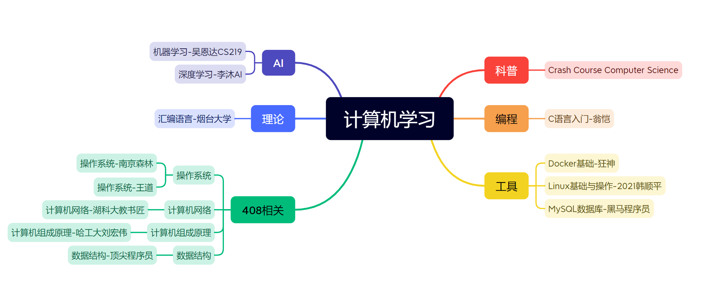

无聊记录，学过的课，方便梳理，主观

思维导图分类：[思维导图](./计算机学习.xmind)

## 模板：

# 课程名称

**链接**：

​	**video**：

​	**课件**：

**授课教师**：

**视频时长**： &&**预计学时**：

**先修要求**： **有XX基础更好**：

**目录关键词**：

​	**理论概念：**

​	**练习：**

**学习作用**：

​	**对自己/直接目的：**

​	**通用目的：**

**课程难度**：

**评价**：

​	选择原因：

**学习建议**：

**笔记链接**：

**最终效果/项目：**

**可参考博客/资源**：

